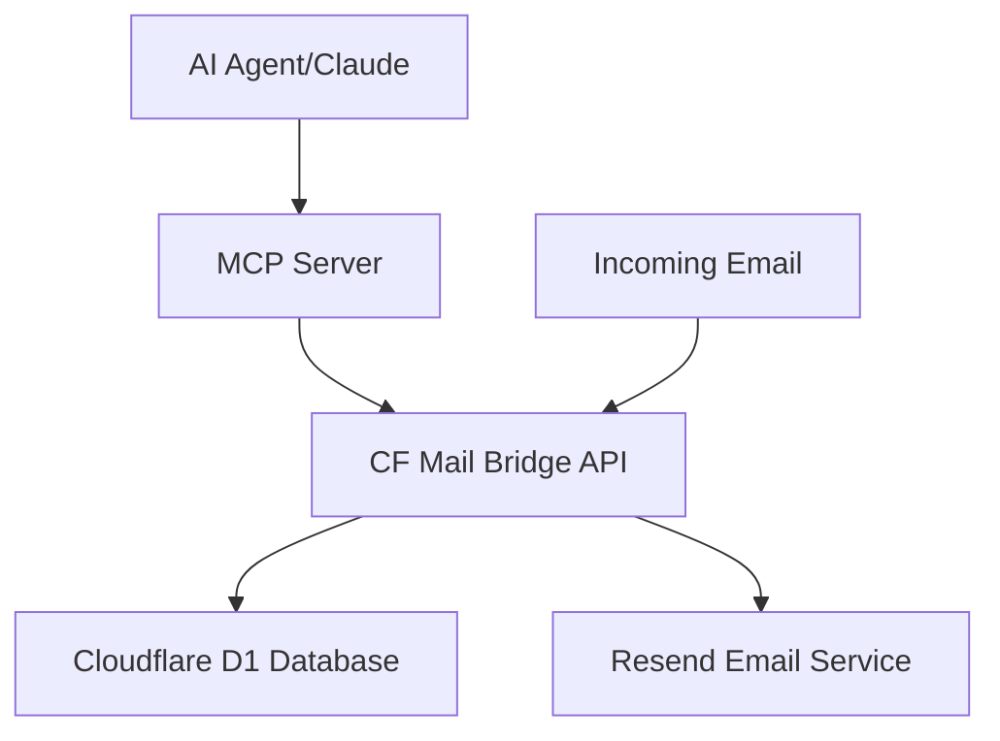

## Quick Start

Get up and running with TAI MCP Email Server in minutes:

### 1. Install Dependencies

```bash
npm install
```

### 2. Configure Environment

```bash
# Required environment variables
export NAME=username          # CF Mail Bridge username  
export PASSWORD=password      # Authentication password
export INSTANCE=desktop       # Agent instance identifier
```

### 3. Register User

```bash
npm start register
```

### 4. Start MCP Server

```bash
npm start
```

### 5. Test with Claude Desktop

Add to your Claude Desktop MCP configuration:

```json
{
  "mcpServers": {
    "tai-email": {
      "command": "npx",
      "args": ["tai-mcp-email-server"]
    }
  }
}
```

## Architecture Overview

TAI MCP Email Server consists of two main components:

- **CF Mail Bridge** - Cloudflare Workers email service providing REST API
- **TAI MCP Server** - MCP server exposing email tools to AI agents



## Key Features

### MCP Tools Available

- **`send_email`** - Send emails with markdown support and automatic HTML conversion
- **`fetch_email`** - Retrieve and mark emails as read with content filtering
- **`list_inbox`** - Browse emails with pagination and filtering options  
- **`reply_email`** - Reply to emails with proper threading and conversation context

### Operating Modes

- **MCP Mode** (Default) - Provides email tools for MCP clients
- **Live Mode** - Monitors for new emails and auto-invokes Claude Code
- **Registration Mode** - Register new users with the API

### Email Features

- HTML ↔ Markdown conversion for AI-friendly content processing
- RFC-compliant email threading with proper Message-ID generation
- Content filtering and formatting for optimal AI interaction
- Support for both plain text and HTML email content

## Use Cases

### Automated Email Assistant
Set up live mode to automatically process incoming emails and generate appropriate responses using AI.

### Email Integration for AI Apps
Embed email capabilities directly into your AI applications using the MCP protocol.

### Customer Support Automation
Process support emails automatically with context-aware AI responses.

### Email Workflow Automation
Create complex email workflows with AI decision-making and response generation.

## Next Steps

- [📖 **Installation Guide**](/guide/installation) - Complete setup instructions
- [⚙️ **Configuration**](/guide/configuration) - Environment variables and settings  
- [🔧 **API Reference**](/api/) - Complete tool and endpoint documentation
- [🏗️ **Development**](/development/) - Architecture and implementation details
- [📋 **Examples**](/examples/) - Real-world usage scenarios